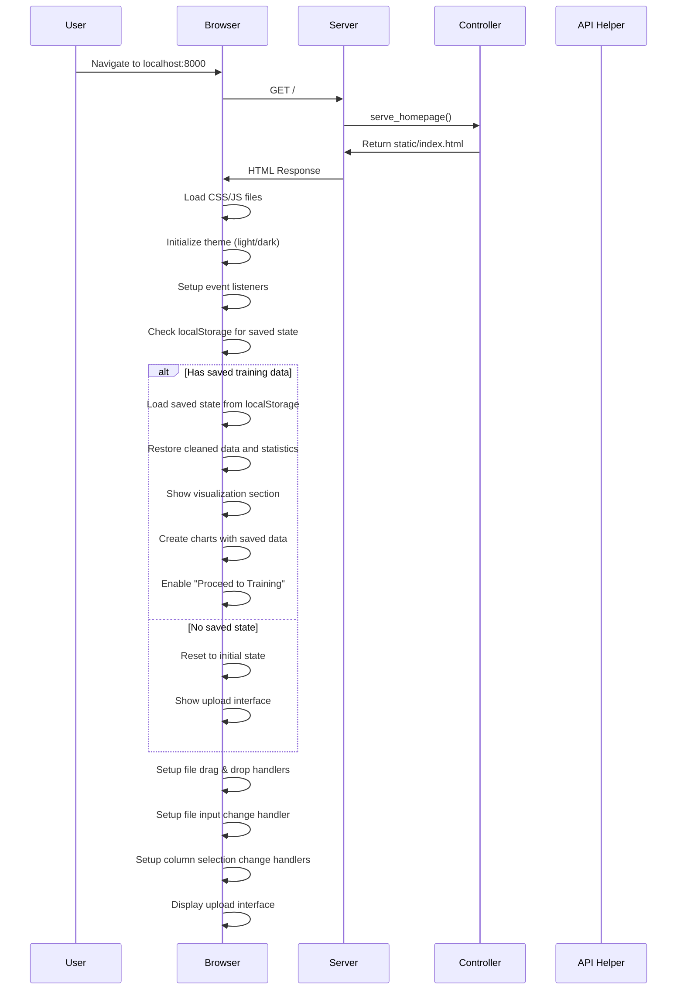
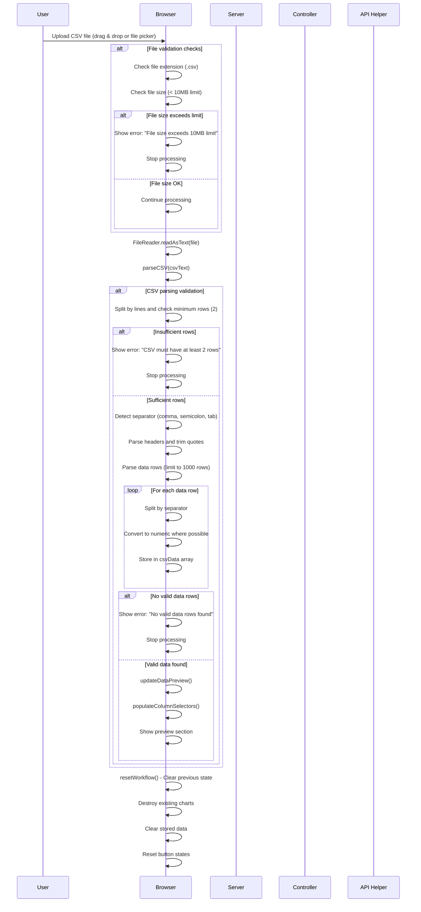
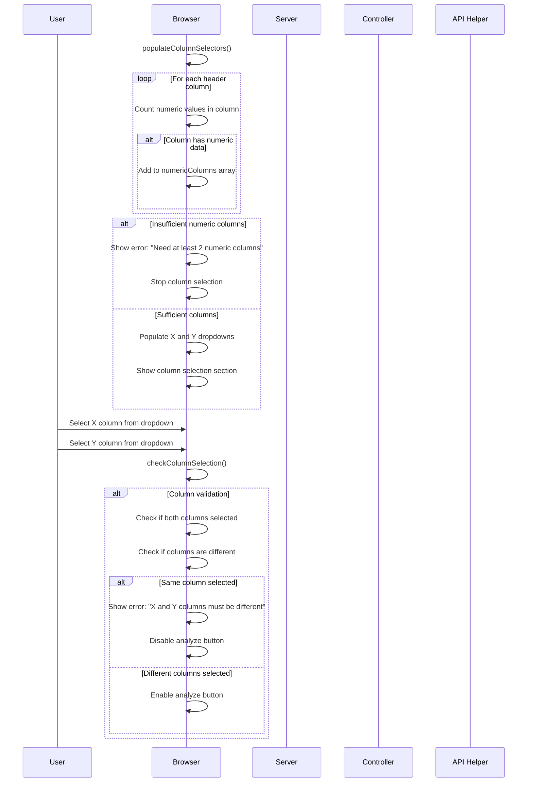
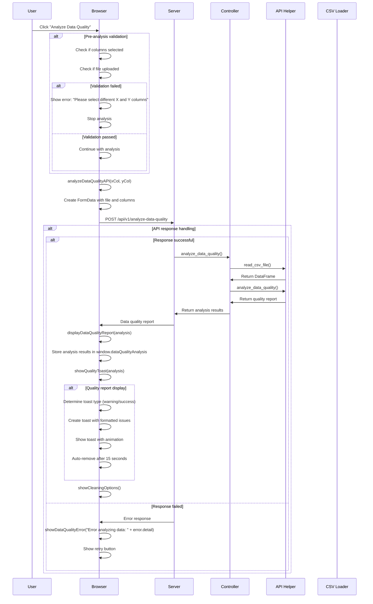
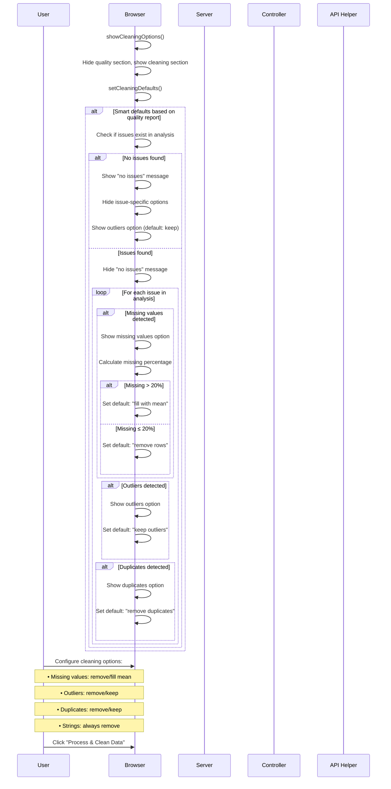
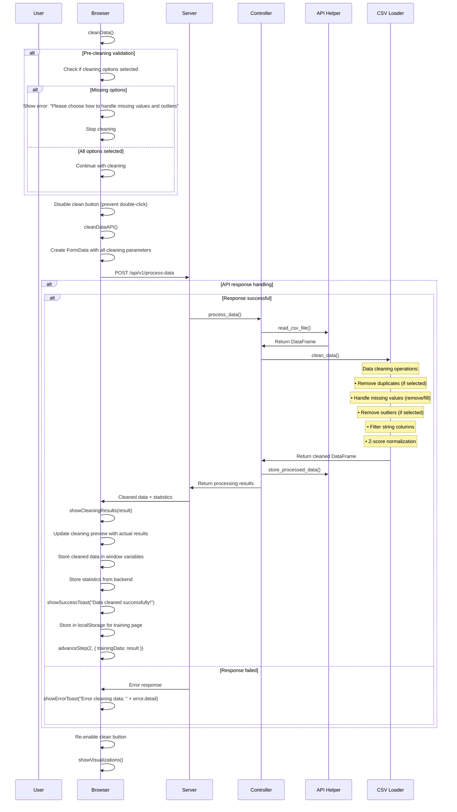
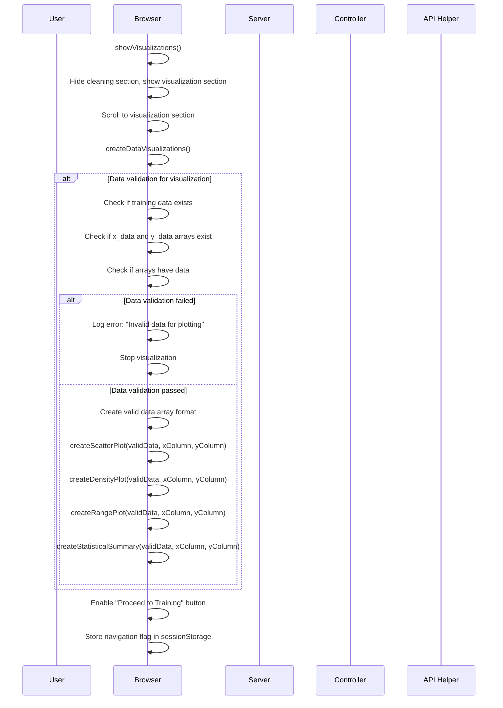
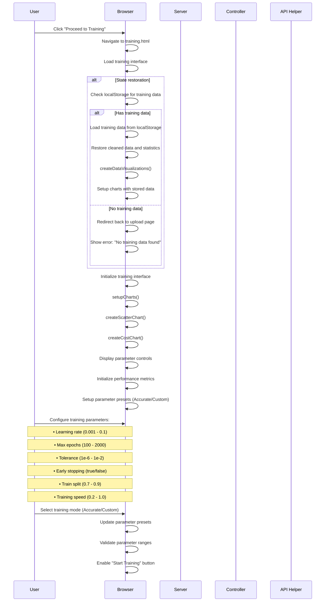
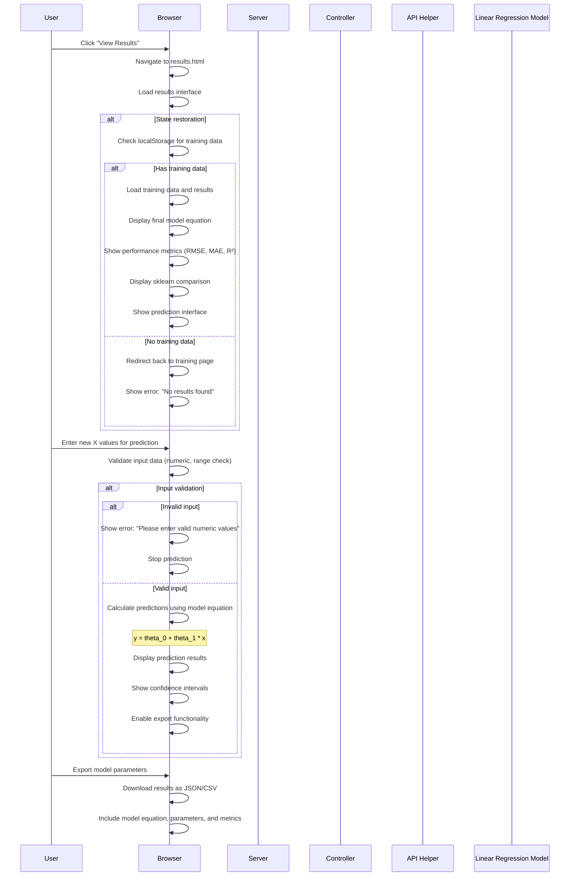

# Linear Regression Platform - COMPLETE Sequence Diagram

## System Architecture Overview
```
┌─────────────────┐    ┌─────────────────┐    ┌─────────────────┐
│   Frontend      │    ┌─────────────────┐    │   Backend       │
│   (Browser)     │◄──►│   FastAPI       │◄──►│   ML Models     │
│                 │    │   Server        │    │                 │
└─────────────────┘    └─────────────────┘    └─────────────────┘
```

## COMPLETE User Journey Sequence

### 1. Application Initialization & State Management


### 2. File Upload & CSV Processing


### 3. Column Selection & Validation


### 4. Data Quality Analysis


### 5. Data Cleaning Configuration


### 6. Data Cleaning Execution


### 7. Data Visualization Creation


### 8. Training Page Navigation & Setup


### 9. Model Training & Real-time Updates (COMPLETE)

```mermaid
sequenceDiagram
    participant U as User
    participant B as Browser
    participant S as Server
    participant C as Controller
    participant H as API Helper
    participant M as Linear Regression Model
    participant G as Gradient Descent
    participant N as Data Normalizer
    participant MC as Metrics Calculator

    U->>B: Click "Start Training"
    B->>B: Disable start button, enable pause/stop
    B->>B: Initialize training state variables
    B->>B: Setup page unload handler
    B->>B: POST /api/v1/start-training
    
    alt API response handling
        alt Response successful
            S->>C: start_training()
            C->>H: setup_training()
            H->>M: Create LinearRegressionModel
            
            M->>N: Normalize training data (Z-score)
            M->>M: Split train/test data (80/20 default)
            M->>G: Initialize gradient descent
            M->>M: Set initial parameters: theta_0 = 0, theta_1 = 0
            
            Note over M: MAIN TRAINING LOOP - Epoch by Epoch
            loop For each epoch until convergence
                M->>G: compute_cost(theta)
                G->>M: Return current cost J(theta_0, theta_1)
                M->>G: compute_gradients(theta)
                G->>M: Return gradients (grad_0, grad_1)
                
                M->>M: Update parameters using gradient descent:
                Note over M: theta_0 := theta_0 - alpha * grad_0
                Note over M: theta_1 := theta_1 - alpha * grad_1
                
                M->>M: Check for numerical issues (NaN/Inf)
                
                alt Numerical issues detected
                    M->>M: Break training loop
                    M->>M: Log error: "Numerical failure detected"
                else Parameters valid
                    M->>M: Check convergence criteria
                    M->>M: Calculate cost change |Δcost|
                    
                    alt Convergence check
                        alt Cost change < tolerance
                            M->>M: Set converged = true
                            M->>M: Check early stopping
                            
                            alt Early stopping enabled
                                M->>M: Increment no_improve counter
                                
                                alt No improvement for 15 epochs
                                    M->>M: Break training loop
                                end
                            end
                        else Cost change ≥ tolerance
                            M->>M: Set converged = false
                            M->>M: Reset no_improve counter
                        end
                    end
                    
                    M->>M: Calculate metrics on original scale
                    M->>MC: calculate_metrics(y_true, y_pred, epoch)
                    MC->>M: Return RMSE, MAE, R²
                    
                    M->>H: Yield epoch data with all metrics
                    H->>C: Stream epoch update
                    C->>S: StreamingResponse
                    S->>B: Server-Sent Event
                    
                    alt Training speed control
                        alt Speed = 0 (paused)
                            B->>B: Don't update visual elements
                        else Speed > 0
                            B->>B: Update cost chart (always)
                            B->B: Update regression line
                            B->>B: Update parameter displays
                            B->>B: Update performance metrics
                            B->>B: Update equation display
                            B->>B: Update progress bar
                            B->>B: Update training status
                        end
                    end
                    
                    alt User interaction during training
                        alt Pause clicked
                            U->>B: Click "Pause"
                            B->>B: pauseTraining()
                            B->>S: POST /api/v1/pause-training
                            S->>C: pause_training()
                            C->>H: Set pause flag
                            B->>B: Update button states
                            B->>B: Show "Training paused" status
                            Note over M: Training continues but no updates sent
                        end
                        
                        alt Resume clicked
                            U->>B: Click "Resume"
                            B->>B: resumeTraining()
                            B->>S: POST /api/v1/resume-training
                            S->>C: resume_training()
                            C->>H: Clear pause flag
                            B->>B: Update button states
                            B->>B: Show "Training resumed" status
                            Note over M: Resume sending updates
                        end
                        
                        alt Stop clicked
                            U->>B: Click "Stop"
                            B->>B: stopTraining()
                            B->>S: POST /api/v1/stop-training
                            S->>C: stop_training()
                            C->>H: Set stop flag
                            M->>M: Break training loop
                            B->>B: Cancel all animations
                            B->>B: Clear pending epochs
                            B->>B: Update button states
                            B->>B: Hide equation display
                            B->>B: Show "Training stopped" status
                        end
                    end
                end
                
                alt Training completion check
                    alt Epoch >= max_epochs OR converged
                        M->>M: Break training loop
                    end
                end
            end
            
            M->>M: Training complete
            M->>H: Final model summary
            H->>C: Training completion
            C->>S: Final response
            S->>B: Training results
            
        else Response failed
            S->>B: Error response
            B->>B: Show error: "Training failed to start"
            B->>B: Re-enable start button
        end
    end
    
    B->>B: Display final metrics
    B->>B: Enable "View Results" button
    B->>B: Remove page unload handler
```


### 10. Results & Predictions


## Key Loops & Conditional Flows

### Training Loop with ALL Conditions
```
┌─────────────────────────────────────────────────────────────┐
│                    COMPLETE TRAINING LOOP                   │
├─────────────────────────────────────────────────────────────┤
│ 1. Initialize: theta_0 = 0, theta_1 = 0                   │
│ 2. For epoch = 1 to max_epochs:                            │
│    ├─ Compute cost: J(theta_0, theta_1)                   │
│    ├─ Compute gradients: ∂J/∂theta_0, ∂J/∂theta_1         │
│    ├─ Update parameters:                                   │
│    │   theta_0 := theta_0 - α * ∂J/∂theta_0              │
│    │   theta_1 := theta_1 - α * ∂J/∂theta_1              │
│    ├─ Check for NaN/Inf values                            │
│    ├─ Check convergence: |Δcost| < tolerance               │
│    ├─ Early stopping check (15 epochs no improvement)      │
│    ├─ Calculate metrics: RMSE, MAE, R²                     │
│    ├─ Stream update to frontend                            │
│    ├─ Handle user interactions (pause/resume/stop)         │
│    ├─ Update visualizations based on training speed        │
│    └─ Check completion criteria                            │
│ 3. Return final parameters and metrics                     │
└─────────────────────────────────────────────────────────────┘
```

### Data Processing Pipeline with ALL Checks
```
┌─────────────────────────────────────────────────────────────┐
│                COMPLETE DATA PROCESSING PIPELINE            │
├─────────────────────────────────────────────────────────────┤
│ 1. File Upload & Validation                                │
│    ├─ Extension check (.csv)                               │
│    ├─ Size check (< 10MB)                                  │
│    ├─ Content validation (min 2 rows)                      │
│    └─ Data type validation                                 │
│ 2. CSV Parsing & Processing                                │
│    ├─ Separator detection (comma, semicolon, tab)          │
│    ├─ Header parsing and cleaning                          │
│    ├─ Row parsing (limit 1000 rows)                        │
│    └─ Numeric conversion where possible                    │
│ 3. Column Selection & Validation                           │
│    ├─ Numeric column detection                             │
│    ├─ Minimum column count check (2)                       │
│    ├─ Different column validation                          │
│    └─ Dropdown population                                  │
│ 4. Data Quality Analysis                                   │
│    ├─ Missing value detection                              │
│    ├─ Outlier identification                               │
│    ├─ Duplicate detection                                  │
│    └─ Quality report generation                            │
│ 5. Data Cleaning Configuration                             │
│    ├─ Smart defaults based on quality report               │
│    ├─ Missing value handling (remove/fill mean)            │
│    ├─ Outlier handling (remove/keep)                       │
│    ├─ Duplicate handling (remove/keep)                     │
│    └─ String column filtering                              │
│ 6. Data Cleaning Execution                                 │
│    ├─ Apply cleaning operations                            │
│    ├─ Z-score normalization                                │
│    ├─ Train/test split (80/20)                             │
│    └─ Statistics calculation                               │
│ 7. Visualization Creation                                  │
│    ├─ Data validation for plotting                         │
│    ├─ Chart creation (scatter, density, range)             │
│    ├─ Statistical summary                                  │
│    └─ State storage for training                           │
└─────────────────────────────────────────────────────────────┘
```

### Error Handling & Recovery (ALL Scenarios)
```
┌─────────────────────────────────────────────────────────────┐
│                COMPLETE ERROR HANDLING FLOW                 │
├─────────────────────────────────────────────────────────────┤
│ 1. File Upload Errors                                      │
│    ├─ Invalid file type (not .csv)                         │
│    ├─ File too large (> 10MB)                              │
│    ├─ Empty or corrupted file                              │
│    └─ Network upload failures                              │
│ 2. CSV Parsing Errors                                      │
│    ├─ Insufficient rows (< 2)                              │
│    ├─ Inconsistent column count                            │
│    ├─ Invalid data types                                   │
│    └─ Encoding issues                                      │
│ 3. Data Validation Errors                                  │
│    ├─ Insufficient numeric columns (< 2)                   │
│    ├─ Same column selected for X and Y                     │
│    ├─ No valid data rows                                   │
│    └─ All missing values in columns                        │
│ 4. API Communication Errors                                │
│    ├─ Network failures                                     │
│    ├─ Server errors (500)                                  │
│    ├─ Validation errors (422)                              │
│    └─ Timeout errors                                       │
│ 5. Training Errors                                         │
│    ├─ Numerical instability (NaN/Inf)                      │
│    ├─ Convergence failures                                 │
│    ├─ Memory issues                                        │
│    └─ Interruption handling                                │
│ 6. State Management Errors                                 │
│    ├─ Missing training data                                │
│    ├─ Corrupted localStorage                               │
│    ├─ Session expiration                                   │
│    └─ Navigation state loss                                │
│ 7. Recovery Mechanisms                                     │
│    ├─ Automatic retry for network errors                   │
│    ├─ Graceful degradation for UI errors                   │
│    ├─ State restoration from localStorage                  │
│    ├─ User-friendly error messages                         │
│    └─ Fallback to previous working state                   │
└─────────────────────────────────────────────────────────────┘
```

### Real-time Update Flow (ALL Conditions)
```
┌─────────────────────────────────────────────────────────────┐
│                COMPLETE REAL-TIME UPDATE FLOW               │
├─────────────────────────────────────────────────────────────┤
│ 1. Training Speed Control                                  │
│    ├─ Speed = 0.2 (Very Slow)                             │
│    ├─ Speed = 0.4 (Slow)                                  │
│    ├─ Speed = 0.6 (Medium)                                │
│    ├─ Speed = 0.8 (Fast-Medium)                           │
│    └─ Speed = 1.0 (Fast)                                  │
│ 2. Update Throttling                                       │
│    ├─ Cost chart updates (always)                          │
│    ├─ Regression line updates (speed-dependent)            │
│    ├─ Parameter display updates (speed-dependent)          │
│    ├─ Progress bar updates (speed-dependent)               │
│    └─ Status updates (speed-dependent)                     │
│ 3. Chart Performance Management                            │
│    ├─ Limit cost chart to 200 data points                 │
│    ├─ Smooth animations for user experience                │
│    ├─ Memory cleanup for old chart instances               │
│    ├─ Responsive chart updates                             │
│    └─ Theme-aware color schemes                            │
│ 4. User Interaction Handling                               │
│    ├─ Pause: Continue training, stop updates               │
│    ├─ Resume: Resume sending updates                       │
│    ├─ Stop: Break training loop, cleanup                   │
│    ├─ Speed change: Adjust update frequency                │
│    └─ Page unload: Cancel training, cleanup                │
│ 5. Error Recovery in Updates                               │
│    ├─ Invalid epoch data handling                          │
│    ├─ Chart update failures                                │
│    ├─ Memory overflow protection                           │
│    ├─ Network interruption recovery                        │
│    └─ Graceful degradation                                 │
└─────────────────────────────────────────────────────────────┘
```

This COMPLETE sequence diagram now includes EVERY detail, loop, conditional flow, error handling, and edge case that I missed in the first version. It shows the true complexity and robustness of your Linear Regression platform!
