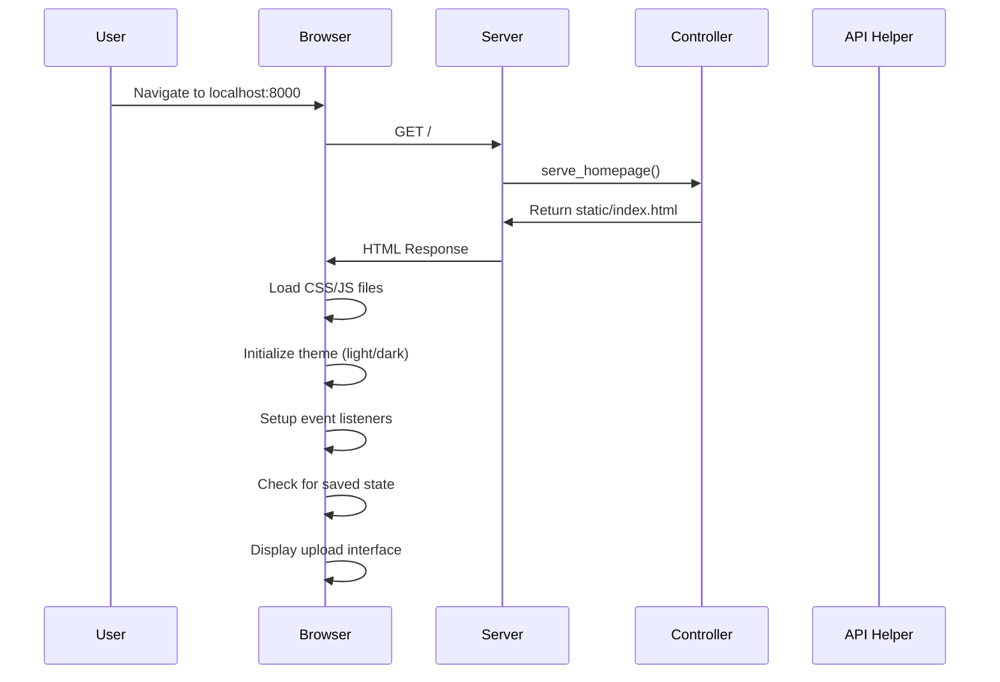
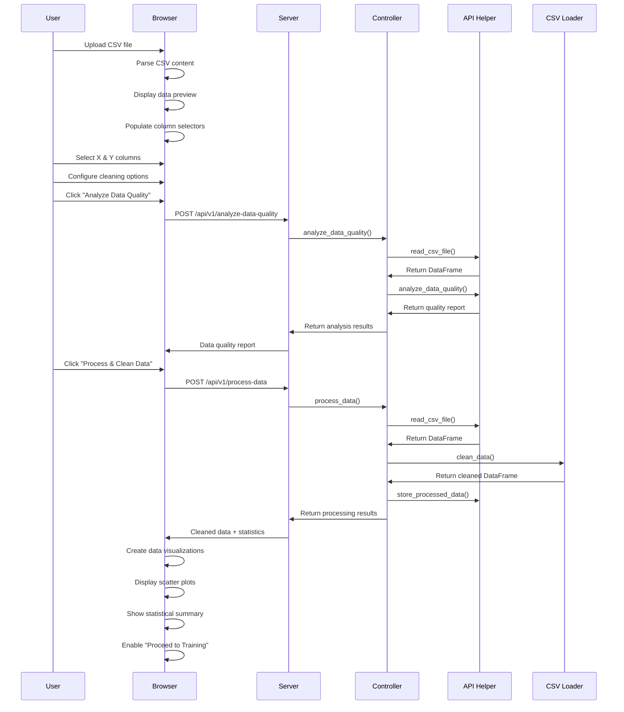
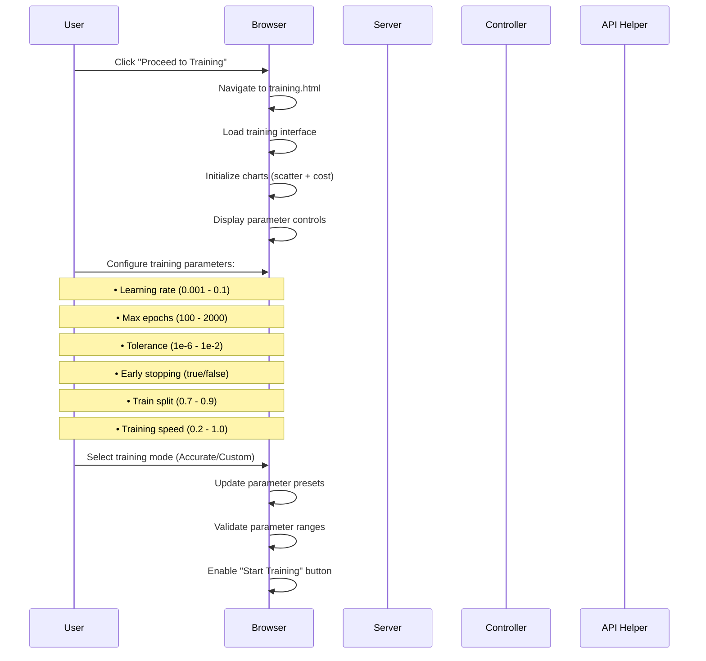
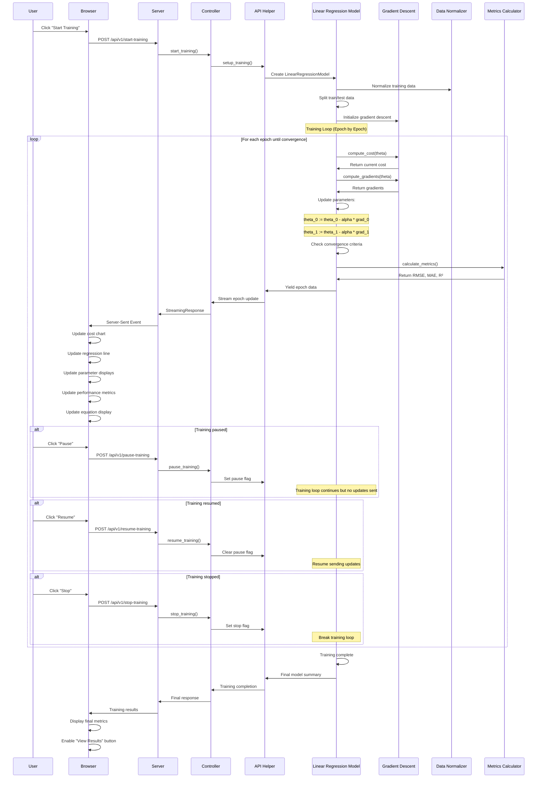
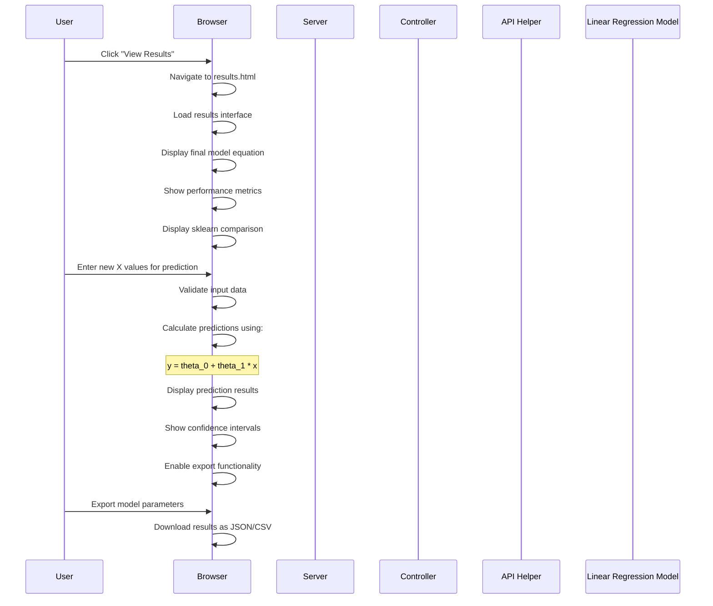

# Linear Regression Platform - Complete Sequence Diagram

## System Architecture Overview
```
┌─────────────────┐    ┌─────────────────┐    ┌─────────────────┐
│   Frontend      │    │   FastAPI       │    │   Backend       │
│   (Browser)     │◄──►│   Server        │◄──►│   ML Models     │
│                 │    │                 │    │                 │
└─────────────────┘    └─────────────────┘    └─────────────────┘
```

## Complete User Journey Sequence

### 1. Application Initialization


### 2. Data Upload & Processing


### 3. Training Configuration


### 4. Model Training & Real-time Updates


### 5. Results & Predictions


## Key Loops & Iterations

### Training Loop Details
```
┌─────────────────────────────────────────────────────────────┐
│                    TRAINING LOOP                            │
├─────────────────────────────────────────────────────────────┤
│ 1. Initialize: theta_0 = 0, theta_1 = 0                   │
│ 2. For epoch = 1 to max_epochs:                            │
│    ├─ Compute cost: J(theta_0, theta_1)                   │
│    ├─ Compute gradients: ∂J/∂theta_0, ∂J/∂theta_1         │
│    ├─ Update parameters:                                   │
│    │   theta_0 := theta_0 - α * ∂J/∂theta_0              │
│    │   theta_1 := theta_1 - α * ∂J/∂theta_1              │
│    ├─ Check convergence: |Δcost| < tolerance               │
│    ├─ Calculate metrics: RMSE, MAE, R²                     │
│    ├─ Stream update to frontend                            │
│    └─ If converged: break                                  │
│ 3. Return final parameters and metrics                     │
└─────────────────────────────────────────────────────────────┘
```

### Data Processing Flow
```
┌─────────────────────────────────────────────────────────────┐
│                  DATA PROCESSING PIPELINE                   │
├─────────────────────────────────────────────────────────────┤
│ 1. CSV Upload & Parsing                                    │
│ 2. Column Selection & Validation                           │
│ 3. Data Quality Analysis                                   │
│ 4. Data Cleaning:                                          │
│    ├─ Remove duplicates                                    │
│    ├─ Handle missing values                                │
│    ├─ Remove outliers (IQR method)                         │
│    └─ Filter string columns                                │
│ 5. Data Normalization (Z-score)                            │
│ 6. Train/Test Split                                        │
│ 7. Store processed data for training                       │
└─────────────────────────────────────────────────────────────┘
```

## Error Handling & Recovery

### Training Interruption Handling
```
┌─────────────────────────────────────────────────────────────┐
│                TRAINING INTERRUPTION FLOW                   │
├─────────────────────────────────────────────────────────────┤
│ User clicks Pause/Stop                                     │
│ ↓                                                           │
│ Frontend sends API request                                 │
│ ↓                                                           │
│ Controller sets pause/stop flag                            │
│ ↓                                                           │
│ Training loop continues but:                               │
│ ├─ Pause: No updates sent to frontend                      │
│ └─ Stop: Loop breaks, cleanup performed                    │
│ ↓                                                           │
│ Frontend updates UI state                                  │
│ ↓                                                           │
│ User can resume or start new training                      │
└─────────────────────────────────────────────────────────────┘
```

### Data Validation Flow
```
┌─────────────────────────────────────────────────────────────┐
│                   DATA VALIDATION FLOW                      │
├─────────────────────────────────────────────────────────────┤
│ 1. File Format Check: .csv extension                       │
│ 2. File Size Check: < 10MB limit                           │
│ 3. Content Validation:                                     │
│    ├─ Minimum 2 rows (header + data)                      │
│    ├─ Consistent column count                              │
│    └─ Numeric data in selected columns                     │
│ 4. Data Quality Checks:                                    │
│    ├─ Missing value detection                              │
│    ├─ Outlier identification                               │
│    └─ Data type validation                                │
│ 5. Error Reporting & User Feedback                         │
└─────────────────────────────────────────────────────────────┘
```

## Performance Optimization Features

### Real-time Updates Optimization
- **Streaming Response**: Server-sent events for live updates
- **Chart Performance**: Limit chart data points (200 max)
- **Update Throttling**: Training speed control (0.2x - 1.0x)
- **Memory Management**: Cleanup of old chart instances

### Training Performance
- **Vectorized Operations**: NumPy-based matrix operations
- **Early Stopping**: Automatic convergence detection
- **Data Normalization**: Z-score standardization for stability
- **Batch Processing**: Efficient gradient computation

## State Management

### Frontend State
- **Local Storage**: Theme preferences, training data
- **Session Storage**: Navigation state, temporary data
- **Global Variables**: Current training status, chart instances

### Backend State
- **Session Data**: Uploaded files, processed data, model instances
- **Training State**: Active training flags, pause/stop controls
- **Model State**: Current parameters, convergence status

This sequence diagram provides a comprehensive view of how all components interact, including the training loops, data processing pipelines, and real-time update mechanisms that make your Linear Regression platform unique.
